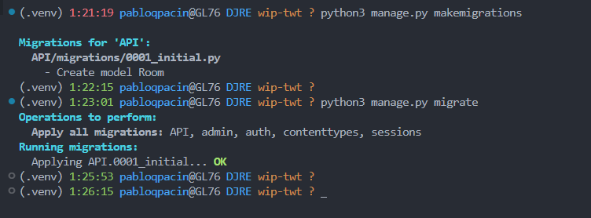

# [TWT-TUTORIAL — Django & React](https://www.youtube.com/watch?v=JD-age0BPVo&list=PLzMcBGfZo4-kCLWnGmK0jUBmGLaJxvi4j&ab_channel=TechWithTim)


TUTORIAL STATUS:
```markdown
# Django & React Tutorial!
Introduction
Part 01 - Full Stack Web App With Python & JavaScript
Part 02 - Django REST Framework
* Part 03 - React Integration Using Webpack & Babel
Part 04 - React Router and Building Components
Part 05 - Handling POST Requests (Django REST)
Part 06 - Material UI Components
Part 07 - Calling API Endpoints From React
Part 08 - Creating The Room Join Page
Part 09 - ComponentDidMount and Django Sessions
Part 10 - Django Sessions and Leaving Rooms
Part 11 - Updating Django Models
Part 12 - React Default Props and Callbacks
Part 13 - Spotify API Tutorial (Auth & Tokens)
Part 14 - Using the Spotify API
Part 15 - Pausing & Playing Music With Spotify
Part 16 - Skipping Songs and Handling Votes
Part 17 - Functional Components (useState, useEffect)
```

**NOTES**:
- About CODE snippets:
  - commented code is important source code we just haven't edited
- Extra documentation:
  - @TWT: [What To Learn To Become a Python Backend Developer](https://youtu.be/pbP5bqfbUPk)
  - @Django: [Models](https://docs.djangoproject.com/en/4.1/topics/db/models/) — relevant for # Part 2.1

--- 

*Table of Contents*
- [TWT-TUTORIAL — Django \& React](#twt-tutorial--django--react)
  - [Introduction](#introduction)
  - [Part 1 — Full Stack Web App With Python \& JavaScript](#part-1--full-stack-web-app-with-python--javascript)
    - [1. SETUP](#1-setup)
      - [1.1 System installs, VSCode extensions](#11-system-installs-vscode-extensions)
      - [1.2 Install Django within `(.venv)`, create **TWT** project, create **API** app](#12-install-django-within-venv-create-twt-project-create-api-app)
    - [2. Customize dev-server landing page (add `API` to `TWT`)](#2-customize-dev-server-landing-page-add-api-to-twt)
      - [2.1 Add **API** to **TWT** in `TWT/settings.py`](#21-add-api-to-twt-in-twtsettingspy)
      - [2.2 Create FIRST **API** VIEW in `API/views.py`](#22-create-first-api-view-in-apiviewspy)
      - [2.3 Config URLs in `TWT/urls.py`](#23-config-urls-in-twturlspy)
      - [2.4 Create `API/urls.py` for **API** URLs](#24-create-apiurlspy-for-api-urls)
      - [2.5 Keeping database updated with migrations...](#25-keeping-database-updated-with-migrations)
      - [2.6 Run development server to test new VIEW](#26-run-development-server-to-test-new-view)
      - [2.7 Modify VIEW in real time](#27-modify-view-in-real-time)
    - [3. Experimenting with URLs](#3-experimenting-with-urls)
      - [3.1 Tweak `API/urls.py`](#31-tweak-apiurlspy)
      - [3.2 Tweaking `TWT/urls.py`](#32-tweaking-twturlspy)
  - [Part 2 — Django REST Framework (REST API)](#part-2--django-rest-framework-rest-api)
    - [1. Modify `API/models.py`](#1-modify-apimodelspy)
      - [1.1 Create `room` model with **5 atributes**](#11-create-room-model-with-5-atributes)
      - [1.2 Define `generate_unique_code` function](#12-define-generate_unique_code-function)
      - [1.3 Make MIGRATIONS ~~and test the server~~](#13-make-migrations-and-test-the-server)
    - [2. Create an "API VIEW"](#2-create-an-api-view)
      - [2.1 Create `API/serializers.py`](#21-create-apiserializerspy)
      - [2.2 Modify `API/views.py`](#22-modify-apiviewspy)
      - [2.3 Modify `API/urls.py`](#23-modify-apiurlspy)
      - [2.4 Test the server!!](#24-test-the-server)
    - [3. Making **Rooms**!](#3-making-rooms)
      - [3.1 Create a first Room](#31-create-a-first-room)
      - [3.2 See Rooms list on browser](#32-see-rooms-list-on-browser)
    - [4. Change `home` for `room` and recap](#4-change-home-for-room-and-recap)
  - [Part 3 — React Integration Using Webpack \& Babel](#part-3--react-integration-using-webpack--babel)


## Introduction

- OVERVIEW
  - Fullstack Web Application
     - Backend: Django with Python
     - Frontend: React with JavaScript
  - Use Spotify API
  - WEB APP
    - **"Collaborative music playing system"**
    - (group of people control music being played)
    - one HOST can CREATE A ROOM
    - (preferably the person controlling the music)
    - shares CODE with people, to JOIN THE ROOM
    - according with PERMISSIONS, people can:
      -  VOTE TO SKIP songs
      -  PAUSE and PLAY songs...
   -  HOST's Spotify will follow instructions,
   -  despite people not being on the same network!

> TUTO uses Windows as main OS...

## Part 1 — Full Stack Web App With Python & JavaScript

### 1. SETUP

#### 1.1 System installs, VSCode extensions

- [ ] VS Code + extensions
  - [ ] Prettier (Prettier)
  - [x] Python (Microsoft)
    - auto-installs: Jupyter, Pylance, etc.
  - [x] Django (Baptiste D.)
  - [x] React (dsznajder)
  - [ ] JavaScript (JavaScript)
- [x] Python
  - in our Ubuntu WSL VM: Python==3.10.6
- [ ] **NPM + NODE.JS** 

#### 1.2 Install Django within `(.venv)`, create **TWT** project, create **API** app

Tim's tutorial steps are documented below.

> This part is automated with our `DJRE.7z` installer

```bash
# Verify Python is installed
python3 --version

# Verify pip is installed
pip --version || pip3 --version
# unlike TIM... MUST HAVE RUN
sudo apt install python3-pip python3-venv
# also must be in relevant dir
mkdir ~/WIP-TWT
mkdir ~/WIP-TWT/DJRE
cd ~/WIP-TWT/DJRE

# Create & Activate virtual environment
python3 venv .venv
source .venv/bin/activate
# not performed by TIM but IMPORTANT

# Install Django + else
pip install django djangorestframework python-dotenv
# unlike TIM, dotenv for the SECURE-SECRETKEY thing

# Create Django project
django-admin startproject TWT .
# unlike TIM, we include "."
# btw... TWT ProjectName is "music_controller"

# Create APP for API management
django-admin startapp API
```

> At this point, since we are using Git+Github, we should have followed INSTRUCTIONS to protect the SECRET KEY (see [docs/modPyGit.md](/docs/modPyGit.md)) <!--UPDATE WITH 'DJRE.7Z' WHEN READY!!!!!!!!!!!!-->

### 2. Customize dev-server landing page (add `API` to `TWT`)

In a way, this process is pretty much like what we did for @Microsoft's ['Hello, Django!' tutorial](https://learn.microsoft.com/en-us/windows/python/web-frameworks).

IMPORTANT: follow the DRILL and activate `(.venv)` ALWAYS before running any Django.

#### 2.1 Add **API** to **TWT** in `TWT/settings.py`

- create reference to `API/apps.py`, namely its `ApiConfig` default function
- add `rest_framework` for later (another app)

```python
# INSTALLED_APPS = [
    'API.apps.ApiConfig',
    'rest_framework',
# ]
```
> Mind 'api' vs 'API'

#### 2.2 Create FIRST **API** VIEW in `API/views.py` 

- We want new ENDPOINTS! (eg. /home /profile).
- Write this code

> Remember, COMMENTED code in code snippets is just code we DON'T EDIT

```python
# from django.shortcuts import render
from django.http import HttpResponse

# Create your views here.
def main(request)
    return HttpResponse("supdawg")
```
<details>
<summary>Tim explains request</summary>

- necessary `request` parameter in `main` function
- for incoming REQUESTS to server (as defined in function), our ENDPOINT will return a response (in varying format, like JSON, **HTML**...)
- we still need to figure out how URLS point to FUNCTION, what's the PATH?
</details>

#### 2.3 Config URLs in `TWT/urls.py`

- import `include` function
- add `path('', include('API.urls'))`; blank meaning that ANY URL (ie. http://127.0.0.1:8000/?) will be sent to the **API** URL 

```python
from django.urls import path, include

# urlpatterns = [
#     path('admin/', admin.site.urls),
    path('', include('API.urls'))
# ]
```

> Mind 'api' VS 'API'

#### 2.4 Create `API/urls.py` for **API** URLs

- copypaste and edit contents of `TWT/urls.py`
- rather than creating new files, we'll establish reference to our single ENDPOINT in `API/views.py`, calling its `main` function

```python
# copypasting most from 'TWT/urls.py' 
from django.urls import path
# not from 'TWT/.urls.py'
from .views import main

urlpatterns = [
    # by us
    path('', main)
]
```

#### 2.5 Keeping database updated with migrations...

- Almost ready to TEST SERVER! One more last thing, dealing with **MIGRATIONS**!
- Doing it now before first boot up of **API** app to properly initialize the database.
- Should run this after changes to MODELS or the database in general.


```bash
# BE SURE TO BE WITHIN (.venv)
source .venv/bin/activate

# Run the commands
python3 manage.py makemigrations
python3 manage.py migrate
# Everything should be "OK"
```

#### 2.6 Run development server to test new VIEW

```bash
# BE SURE TO BE WITHIN (.venv)...

# Default port will be 8000
python3 manage.py runserver 5050
```

- Click on URL (http://127.0.0.1:5050)
- See blank website displaying "**supdawg**" || ✅<!--Tim says... HTML... ??-->

#### 2.7 Modify VIEW in real time

- As our server runs, we can still modify `API/views.py` to return a different dev-server landing-page:

```python
    return HttpResponse("<h1>supdawg</h1>\n\nsupdawg")
```

- as we save the file, our server is updated (see TERMINAL)

> Meaning that with Django, we only have to run a server once, unless performing major Database changez!

- refresh page in browser to see the LIVE changes! || ✅


### 3. Experimenting with URLs

Let's break and fixes ROUTES, the PATH, the ADDRESS BAR, URLs ultimately.


#### 3.1 Tweak `API/urls.py`

- Open the file and perform this change:
```python
urlpatterns = [
    path('home', main)
]
```

- update browser (http://127.0.0.1:8000/)
- since current ADRESS ROUTE is still `''` (ie. nothing), site fails to load, returning default "Page not found" || ❌ <!--WHAT IF I `Ctrl+Shift+I` ON IT-->


- as we change our ADRESS ROUTE to http://127.0.0.1:8000/home , we do see the expected "**supdwag**" || ✅

#### 3.2 Tweaking `TWT/urls.py`

- open the file and perform this change:

```python
urlpatterns = [
    path('api/', include('API.urls'))
    # mind the slash
]
```

- refresh browser and find "Page not found" again || ❌
- now changing our address to http://127.0.0.1:8000/api/home (`.../api/home`) DOES load the site! || ✅

> meaning that `TWT/urls.py` rules, it's a "first destination", while `API/urls.py` comes second
> 
> analyse the last code snippet!!

- TIM adds `path('', main)` to `API/urls.py`,
which allows for the site to load whether to the adress `/api/home` or `/api`!


## Part 2 — Django REST Framework (REST API)

    If you have made it here, give yourself a pat on the back.
    Not many people make it past the first video.

Dealing with:
- Django REST framework
- build first **DATABASE** model
- buildings some API endpoints


### 1. Modify `API/models.py`

- The database format isn't a **table** but a **[MODEL](https://docs.djangoproject.com/en/4.1/topics/db/models/)**

> Apparently Django "allows us to write Python code" cuz it "will interpret" and "automatically perform all of the database operations for us"... Me no likey.

#### 1.1 Create `room` model with **5 atributes**

- Our first MODEL will be a "room model".
- That is, because our **web app TWT** aims at "grouping similar users together in a room".
- Indeed the ROOM will take control over the host's music.
- Now, let's code the following in `API/models.py`:

```python
from django.db import models

class Room(models.Model):
    code = models.CharField(max_length=8, default="", unique=True)
    host = models.CharField(max_length=50, unique=True)
    guest_can_pause = models.BooleanField(null=False, default=False)
    votes_to_skip = models.IntegerField(null=False, default=1)
    created_at = models.DateTimeField(auto_now_add=True)
```

> Operation reminds me of the Flask project.

- Create a MODEL + inheritance with `class Room(models.Model):`
- Now, define fields, ie. pieces of info we want to store for each ROOM!
- Write **5 ATRIBUTES** with their respective **CONSTRAINTS**
  - `max_length` required for `CharField`
  - For `host`, `unique=True` because we only want 1 host... don't we? <!-- WE DO?? --> <!-- TIM mentions something that is "out of the scope" of TUTORIAL... might need to look further into it! -->

> PRO-TIP: with Django/Python...

- FAT MODELS vs THIN VIEWS
- Put most of logic in the models.
 

#### 1.2 Define `generate_unique_code` function

- Make sure `code` will be random and unique to secure our ROOMS:
```python
from django.db import models
import string
import random

def generate_unique_code():
    length = 6

    while True:
        code = ''.join(random.choices(string.ascii_uppercase, k=length))
        if Room.objects.filter(code=code).count() == 0:
            break

    return code
```

#### 1.3 Make MIGRATIONS ~~and test the server~~

Since we modified the database and we added a new model, we gotta make MIGRATIONS. Enter this command again and see the screenshot below.

```bash
python3 manage.py makemigrations
python3 manage.py migrate
```
- notice custom `API`



### 2. Create an "API VIEW"

Now, with **migration done** and **model created** we want to setup an API VIEW
  - Different from standard HTML views
  - Can return all of the rooms present in the database

> Remember, current goal is to **program a Backend**:

<details>
<summary>Tim explains Backend</summary>

- Right now, what we're trying to do is to program a Backend.
- What I mean by Backend is just a server that essentially can handle information. So handle requests, and then give some type of valid response.
- Now, if we think about it, it would make sense that our Frontend would want to be able to access or check specific rooms, right?
- Say a user tries to join a room. Will it needs to look in the Backend and say, okay, you know, does that room exist?
- So we need to create some kind of ENDPOINT that can return to us information about the rooms in a **format** that makes sense. We're probably not going to return HTML code. We probably want to return something, say like **JSON** format, where we have key value pairs that are Frontend can really easily handle look at it and do things with now.

</details>

#### 2.1 Create `API/serializers.py`

- This file will take our model, in this case our class **Room**, and turn its atributes into strings in JSON format.
- Write the following code:

```python
from rest_framework import serializers
from .models import Room

class RoomSerializer(serializers.ModelSerializer):
    class Meta:
        model = Room
        fields = ('id', 'code', 'host', 'guest_can_pause',
            'votes_to_skip', 'created_at')
```

> Change `.model` for `.models`; still `rest_framework` seems to return ERROR

- Why `'id'`?
  - Because of our model's **primary_key**. That is, a unique integer that identifies the model itself.
  - It will be automatically created as new rooms are generated.
  - It's a field not included within `models.py` because it's always generated automatically so we don't have to set it up.

#### 2.2 Modify `API/views.py`

- Delete `HttpResponse` and current `main` function:

```python
from django.http import HttpResponse

def main(request):
    return HttpResponse("<h1>supdawg</h1>\n\nsupdawg")
```

- Write an "API view" that will return "a list of all of the different rooms".
- Now `views.py` should look like this:

```python
from django.shortcuts import render
from rest_framework import generics
from .models import Room
from .serializers import RoomSerializer
    
class RoomView(generics.CreateAPIView):
    queryset = Room.objects.all()
    serializer_class = RoomSerializer
```

> Likely ERROR with `rest_framework` again

- In a nutshell, this becomes a "VIEW already setup to return all of the different rooms" thanks to `queryset`, which will return all Room objects AKA atributes and `serializer_class` that will return them in JSON format!


#### 2.3 Modify `API/urls.py`

- Now we need to link the URLs!!
- Change current code for the following:

```python
from django.urls import path
from .views import RoomView

urlpatterns = [
  # path('home', main)
    path('home', RoomView.as_view())
]
```

#### 2.4 Test the server!!

    We're going to run our server and we're going to pray that everything works fine.

- Run `python3 manage.py runserver`; it worked!
- Open browser and add `/api/home` to default adress (http://127.0.0.1:8000/api/home)
- Find the following page || ✅:


> Notice message `"detail": "Method \"GET"\ not allowed."`


### 3. Making **Rooms**!

- Notice how the **class** we wrote in `API/views.py` leads to a VIEW as good as what we get.
- Notice how the fields in our site are the ones we had in our **serializer class**.

#### 3.1 Create a first Room

Again in our development server landing page (as shown above):

```markdown
# Make Room 0001
- Code: AA0001
- Host: IDK
- Guest can pause: ON
- Votes to skip: 3
```

As we confirm with the **POST** button, the site reloads displaying the following, proving that the ROOM is created || ✅:


> Still, the form should be cleared after pressing POST...

#### 3.2 See Rooms list on browser
/home/pabloqpacin/WIP-TWT/DJRE/docs
Go to `API/views.py` and replace `Create` for `List`:
```python
# class RoomView(generics.CreateAPIView):
class RoomView(generics.ListAPIView):
```

Now, refresh the browser. The "POST-form" is gone, replaced for a list of all Rooms currently stored in our database —only one atm—:

<details>
<summary>Click to see pic</summary>


</details>

> It seems we need to press the button **GET** to actually render the list...

### 4. Change `home` for `room` and recap

Open `API/urls.py` and change:
```python
urlpatterns = [
    # path('home', RoomView.as_view())
    path('room', RoomView.as_view())
]
```


<details>
<summary>Click to see RECAP or # Part 2</summary>

And this is how we set up a rest API.
- We have a way to actually add information in the database, which you just saw.
- Then we have a way to retrieve it.

Now, obviously I'm doing this using the user interface, I'm using the browser, but when we start setting up **REACT**, we'll be doing this through **requests**:
- So we'll just be sending, say like a fetch request to an end point on the server.
- And then that will return to us some information, not in this nice fancy format with all this cool, you know, buttons and UI, but it will give us just this raw data right here, which we'll be able to process and then display on the screen.


So hopefully that is all clear, but that is what I wanted to show you in this tutorial:
- how we set up a serializer
- how we set up a view
- how we get the models going
 
(...)
</details>


## Part 3 — React Integration Using Webpack & Babel

> WORK-IN-PROGRESS
>
> Section in **active development**

See [docs/wip-node.md](/docs/node-docs.md) for on-going documentation.


**STATUS**:


```markdown
# Part 3 — React Integration Using Webpack & Babel

1. Create and prepare **Frontend** app
- 1.1 Verify **NPM** is installed
- 1.2 Create `Frontend` app dir
- 1.3 Create few dirs: **static** + **templates**
2. Using **NPM**
- 2.1 Init NPM
- 2.2 Install NPM modules (ie. React, Babel, Webpack...)
- 2.3 UPDATE `.GITIGNORE`
3. Setup config scripts
- 3.1 Create `frontend/babel.config.json`
- 3.2 Create `frontend/webpack.config.js`
- ...

```